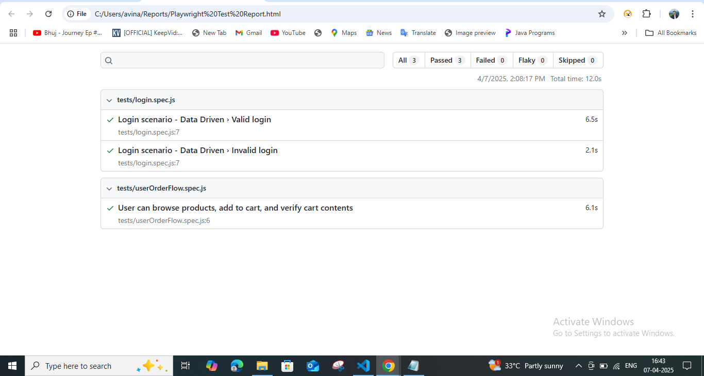

# playwright Page object Model
Setup Instructions

**1. Clone the repository:**

git clone https://github.com/avinashh843324/playwright-sdet-assignment.git
cd playwright-sdet-assignment

**2.Install dependencies**
npm install

**3.Test execution**
npx playwright test

**4.Generate HTML report**
npx playwright test --reporter=html
npx playwright show-report

______________________________________________________________________________________

**TEST SCENARIOS COVERED **

**1. User Authentication**
  a.Login with valid credentials
  b.Login with invalid credentials

**2. Shopping Experience**
  a.Browse and view products
  b.Add at least two products to cart
  c.Verify cart contents
  
**3. Checkout Process**
  a.Proceed to checkout
  b.Fill in minimal required information
  c.Complete order (final confirmation)
  
**4. Extra: Data-Driven Login Test**
  a.Valid and invalid login tested via loginTestData.json

**Approach**

This project follows a modular and scalable architecture based on the Page Object Model (POM). Each page of the application (Login, Product Listing, Cart, Checkout, and Order Confirmation) is encapsulated into its own class inside the pages. This improves code reusability, readability, and makes future maintenance or scaling (e.g., adding more test cases or environments) easier.

The core automation logic is built using Playwright with JavaScript, ensuring fast, reliable, and cross-browser execution. Tests are located in the tests/ folder, logically split into:

1.login.spec.js for user authentication
2.userOrderFlow.spec.js for product selection to checkout

**Key Features:**

a.Page Object Model: Clean abstraction of UI interactions

b.Data-Driven Testing: Implemented in the login test using external testData.json, enabling flexibility to test multiple user variations without duplicating code.

c.Smart Locators: Uses Playwright’s best practices for element targeting, ensuring robustness against UI changes.

d.Effective Waits: Uses Playwright’s built-in waits (expect, toHaveURL, toBeVisible) to ensure test reliability without adding flaky hard waits.

e.Error Handling: Failures are captured using Playwright's HTML reporter and test status monitoring. A screenshot is auto-captured for any failing scenario.

f.Scalable Structure: Easy to extend the test suite for more complex flows by simply adding new page classes and tests without modifying existing ones.

**Evidence**

